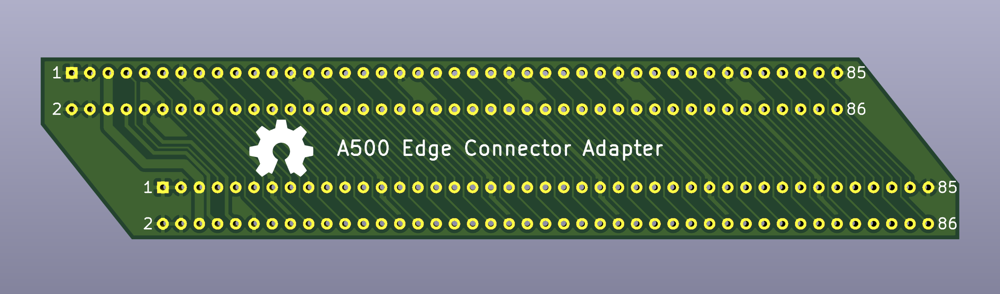
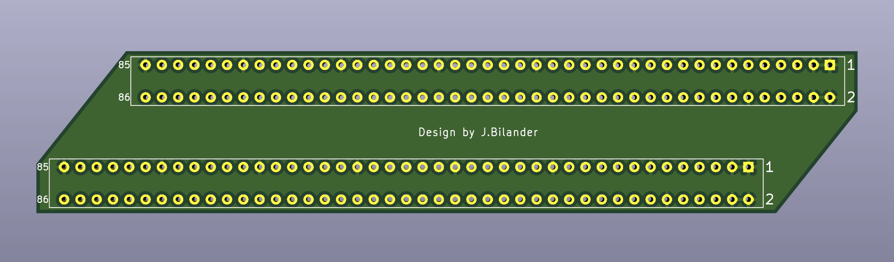
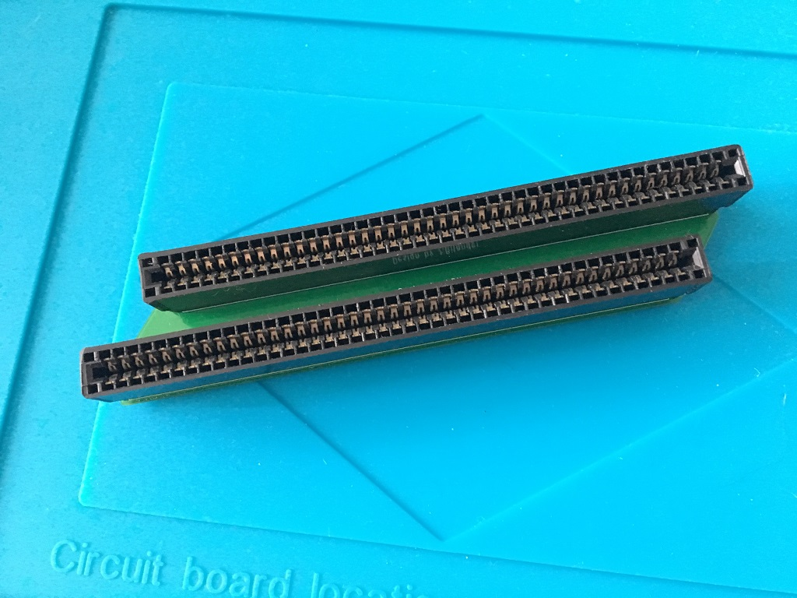
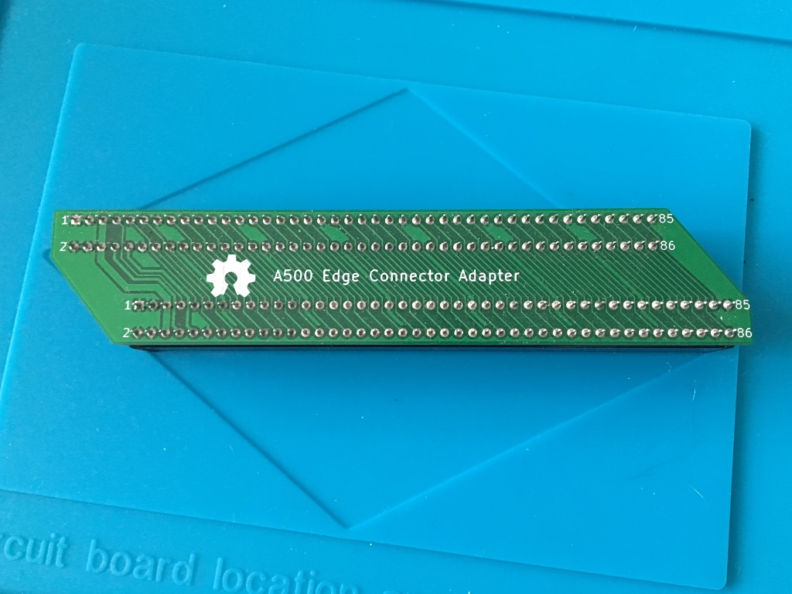
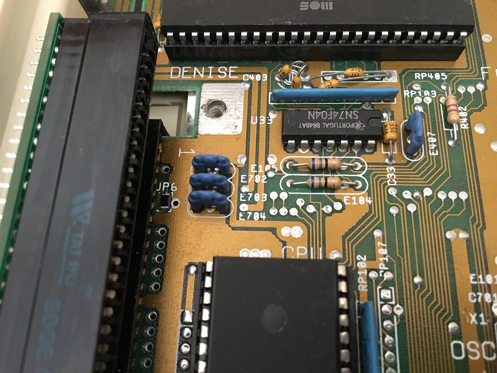
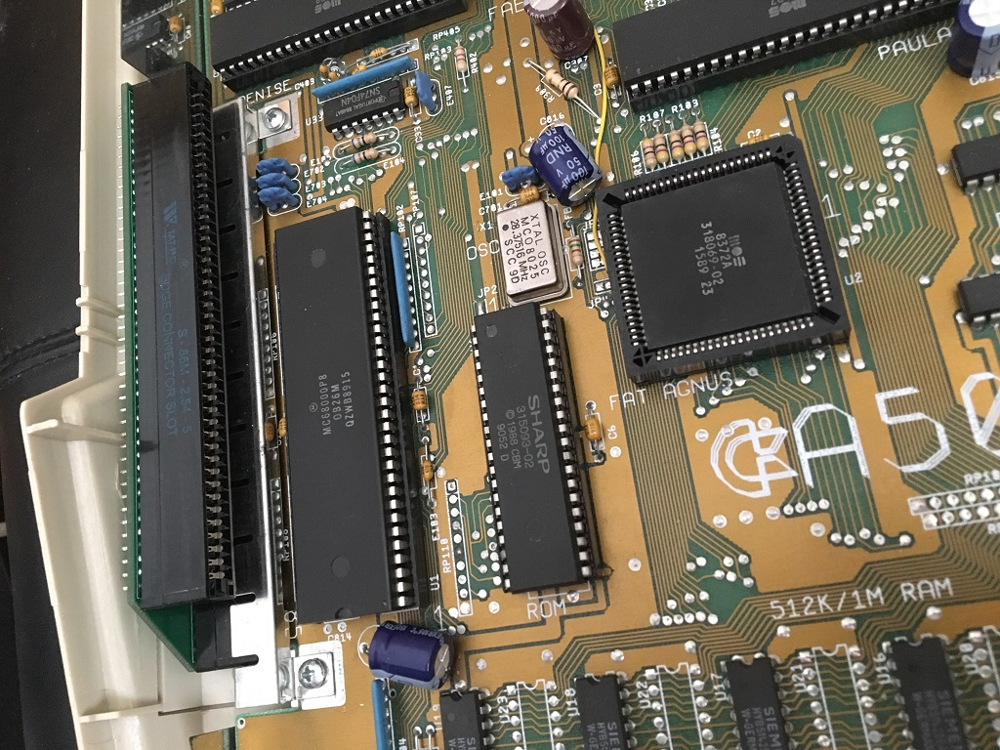
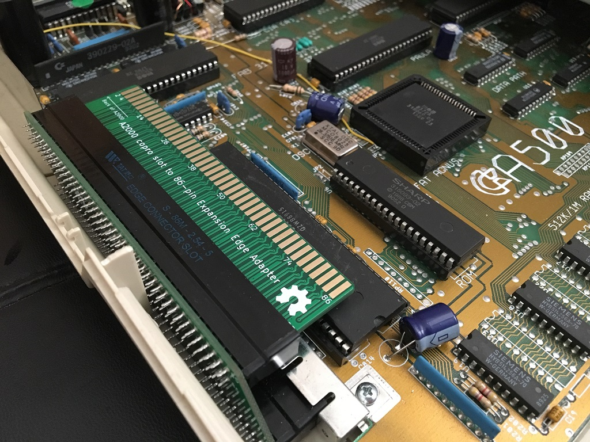
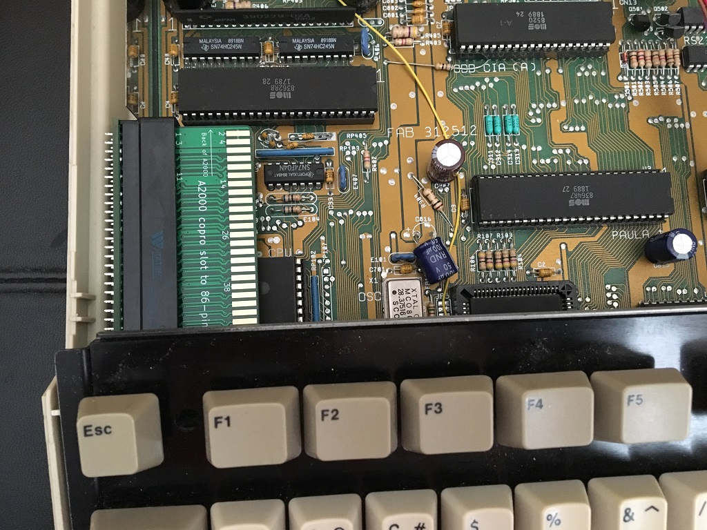
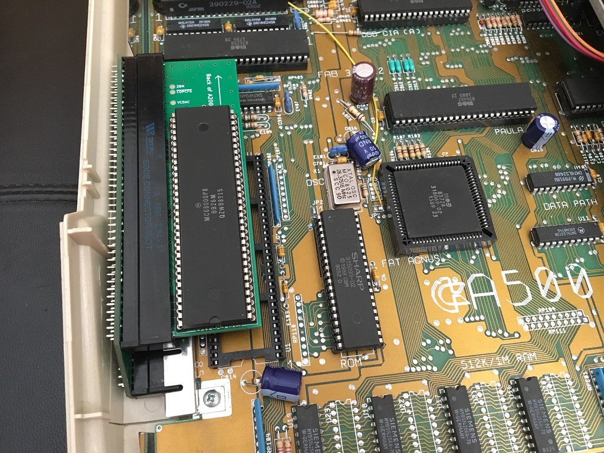

# A500_Edge_Expansion_adapter
A500 86pin edge connector adapter. Turns the expansion edge into a 86pin female socket inside the A500 case.

***

Caveat

In order to install the adaptor you will need to remove the motherboard from the A500 case temporarily, install and put mobo back with the adaptor on. There is not enough room/clearance to install through the sidecar port opening of the A500 case.

***

 

***

86-pin connectors I sourced from here: 
https://www.aliexpress.com/item/33029711948.html

***

***

While installing you might want to put a solder blob or put a 0 Ohm resistor on JP6 (Rev.6A and 8A mobo's) to connect through the 7 MHz clock. I put a 0 Ohm resistor in picture below, and then put back the protective metal plate.

***

***

The adapter clears the keyboard nicely, but not if the inserted card is too bulky towards the keyboard underside. The CPU fitted in the OpenAmiga2000CoproAdapter on picture below touches the keyboard underside, but this was only for temporary testing the edge adapter anyway.

***

***

[![CC BY-SA 4.0][cc-by-sa-shield]][cc-by-sa]

This work is licensed under a
[Creative Commons Attribution-ShareAlike 4.0 International License][cc-by-sa].

[![CC BY-SA 4.0][cc-by-sa-image]][cc-by-sa]

[cc-by-sa]: http://creativecommons.org/licenses/by-sa/4.0/
[cc-by-sa-image]: https://licensebuttons.net/l/by-sa/4.0/88x31.png
[cc-by-sa-shield]: https://img.shields.io/badge/License-CC%20BY--SA%204.0-lightgrey.svg
